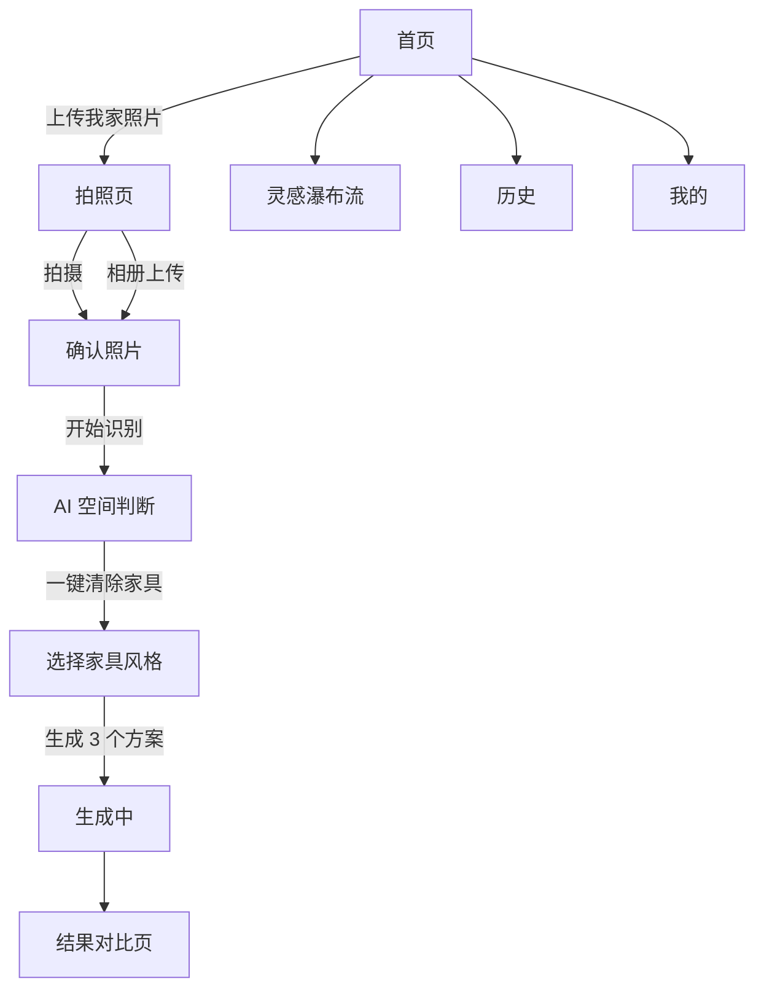

# AI 焕然一居 Vibe Coding PRD

## 1. 需求定义

### 1.1 目标用户

想快速看看自家房间换家具风格效果的个人用户。

### 1.2 使用场景

用户在手机上拍摄或上传自己家的房间照片，AI 保留原空间结构，清除原有家具，并生成 3 个新的家具搭配方案。

### 1.3 核心痛点

- 用户不知道自己家换一种家具风格会不会好看。
- 普通装修效果图容易改动墙体、地板、窗户等硬装，和真实空间不一致。
- 用户拍照时容易角度不正，影响后续生成效果。

### 1.4 产品形态

移动端 H5 / App 原型页面。第一阶段重点做可交互前端界面，不要求真实 AI 生成。

### 1.5 非目标 / 暂不做

- 暂不做硬装改造：不改墙面、地板、门窗、吊顶、灯位。
- 暂不做真实账号系统、支付、订单、施工服务。
- 暂不接真实 AI 接口，先用模拟流程和示例图跑通交互。

## 2. MVP 范围

| 优先级 | 一级模块 | 二级功能 | 功能描述 | 是否本期做 | 备注 |
|---|---|---|---|---|---|
| P0 | 首页 | 杂志感首屏 | 图片满铺背景，顶部品牌、搜索、我的，主 CTA「上传我家照片」 | 是 | 不要改已确认首页结构 |
| P0 | 拍照/上传 | 拍照指引 | 相机页展示虚线框、墙角/地面线指引、构图良好提示 | 是 | 按已有截图风格 |
| P0 | 拍照/上传 | 相册上传 | 拍照页底部保留「相册」入口，可上传本地图片 | 是 | 上传后进入确认页 |
| P0 | AI 判断 | 自动判断家具 | 不让用户选择房间状态，由 AI 判断是否有旧家具 | 是 | 用模拟检测框表现 |
| P0 | AI 清除 | 一键清除家具 | 检测到旧家具后，用户点击清除，保留空间结构 | 是 | 强调只清家具 |
| P0 | 风格选择 | 风格模板 | 选择奶油风、原木风、侘寂风、中古风等家具风格 | 是 | 可用标签筛选 |
| P0 | 生成中 | 模拟生成流程 | 展示识别结构、清除家具、生成家具、检查一致性 | 是 | 进度条或步骤状态 |
| P0 | 结果页 | 3 个方案 | 展示方案 A/B/C，支持前后对比、保存、重新生成 | 是 | 用示例图模拟 |
| P1 | 灵感页 | 瀑布流 | 灵感页用瀑布流展示风格模板 | 是 | 加分类标签 |
| P1 | 历史页 | 历史记录 | 展示最近生成方案列表 | 是 | 静态模拟 |
| P1 | 我的页 | 个人中心 | 展示历史、收藏、空间档案、硬装模式后续开放 | 是 | 静态模拟 |

## 3. 设计要求

### 3.1 首页必须保持

首页结构按已确认版本：

- 图片满铺背景，家居杂志感。
- 顶部左侧：`AI 焕然一居`
- 顶部右侧：`搜索 | 我的`
- 首屏文案：`看看你家 换个风格会怎样`
- 副文案：`保留空间结构，生成 3 个家具搭配方案`
- 主按钮：`上传我家照片`
- 底部导航：`首页 / 灵感 / 历史 / 我的`

### 3.2 拍照页必须包含

- 顶部：返回、标题「拍摄房间」、右侧「示例」
- 相机画面背景为室内房间图
- 中间大虚线取景框
- 墙角/垂直辅助线
- 地面线水平指引
- 提示文案：`让墙角和地面线落在虚线范围内`
- 状态提示：`构图良好，可以拍摄`
- 底部：`相册`、拍摄按钮、`示例`
- 相册入口可上传图片

### 3.3 视觉风格

- 整体：温暖家居杂志感，高级、干净、柔和。
- 首页和拍照页以真实家居图片为主。
- 主色：墨绿色/青绿色按钮。
- 背景：暖米色、奶油白。
- 卡片：圆角 16-20px，轻阴影。
- 字体：中文标题可偏宋体/衬线，功能文字用系统黑体。

## 4. 页面流程

## 5. 页面说明

### 5.1 首页

- 目的：吸引用户上传自己家照片。
- 主要操作：点击「上传我家照片」进入拍照页。
- 顶部「搜索」：弹 toast 或打开搜索态均可。
- 顶部「我的」：进入我的页。
- 底部导航可切换：首页、灵感、历史、我的。

### 5.2 拍照页

- 目的：引导用户拍出适合 AI 识别的房间照片。
- 主要操作：
  - 点击拍摄按钮进入确认照片页。
  - 点击相册上传图片，上传后进入确认照片页。
  - 点击示例显示拍摄说明 toast 或示例弹层。

### 5.3 确认照片页

- 展示用户照片或示例照片。
- 展示照片质量结果：墙面完整、地面可见、透视清晰。
- 操作：重新选择、开始识别。

### 5.4 AI 空间判断页

- AI 自动判断是否有旧家具，不再让用户手动选择房间状态。
- 如果检测到家具，用虚线框标注沙发、柜体、杂物区域。
- 主按钮：`一键清除原有家具`
- 文案强调：保留墙体、窗户、地面、天花板与空间透视。

### 5.5 风格选择页

- 展示家具风格模板。
- 支持标签筛选：全部、奶油风、原木风、侘寂风、中古风、现代简约。
- 可点击模板作为参考风格。
- 主按钮：`生成 3 个家具方案`

### 5.6 生成中页

用模拟进度展示：

1. 识别墙面、地面和透视
2. 清除原有家具
3. 生成家具与软装方案
4. 检查结构一致性

完成后自动进入结果页。

### 5.7 结果页

- 展示方案 A/B/C tabs。
- 展示前后对比图。
- 明确提示：`原有家具已清除，硬装结构未改变`
- 操作：保存图片、重新生成。

### 5.8 灵感页

- 使用瀑布流布局。
- 顶部有风格标签分类。
- 卡片包含图片、标题、风格标签、简短描述。
- 点击卡片可以 toast：`已选为参考风格` 或进入风格详情。

### 5.9 历史页

- 展示最近生成方案列表。
- 每条包含缩略图、标题、生成时间、方案数量。

### 5.10 我的页

- 展示：历史生成、收藏风格、空间档案、硬装模式后续开放。

## 6. 交互状态

| 场景 | 状态 | 处理 |
|---|---|---|
| 拍照构图 | 构图良好 | 显示绿色提示「构图良好，可以拍摄」 |
| 拍照构图 | 构图不佳 | 可显示提示「保持手机水平，露出墙面和地面」 |
| 上传图片 | 成功 | 进入确认照片页 |
| 上传图片 | 未选择文件 | 保持当前页 |
| AI 判断 | 检测到家具 | 展示检测框和一键清除按钮 |
| AI 判断 | 未检测到家具 | 可跳过清除，直接进入风格选择 |
| 生成中 | 加载 | 展示步骤和进度条 |
| 保存结果 | 成功 | toast：`已保存到历史` |

## 7. 技术建议

第一版可直接做单文件或轻量前端：

- HTML/CSS/JS 单文件，适合快速原型。
- 或 React/Vite，适合后续交给 Codex 接入真实流程。
- 图片先用远程示例图或本地 mock 图。
- AI 生成、家具检测、清除家具都先 mock。

## 8. 验收标准

- 打开页面后，默认显示已确认的图片满铺首页。
- 点击「上传我家照片」进入拍照页。
- 拍照页同时存在「相册」和拍摄按钮。
- 点击拍摄按钮进入确认照片页。
- 从确认照片页点击「开始识别」进入 AI 判断页。
- AI 判断页没有“房间状态选择”页面或选项。
- AI 判断页能展示检测家具区域和「一键清除原有家具」按钮。
- 点击清除后进入风格选择页。
- 风格选择页有分类标签和风格模板。
- 点击生成后进入生成中页，并自动跳到结果页。
- 结果页有方案 A/B/C、前后对比、保存、重新生成。
- 底部导航可以进入首页、灵感、历史、我的。
- 灵感页必须是瀑布流，不是普通等高网格。

## 9. 给 Claude 的实现提示

请先做移动端 H5 可交互原型，不接后端，不接真实 AI。重点还原页面结构、交互路径和视觉风格。不要改首页已确认的信息架构和文案。所有 AI 能力用 mock 状态模拟即可。
